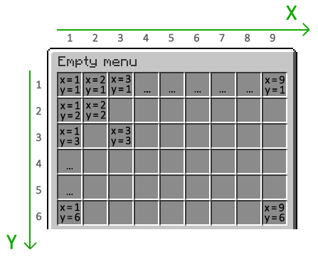
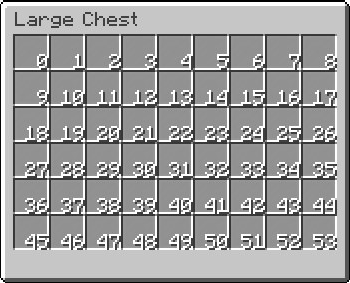

+++
title = "Slot"
weight = 1
+++

Before talking about [Button]({}), let's talk about Slot first.

Slot is a coordinate which is used to determine where the item will be placed in the menu. In **BetterGUI**, there are 2 ways to specify a slot:
- `position-x` and `position-y`
- `slot`

## `position-x` and `position-y`

If you are comfortable with the grid layout, you can set the slot by specifying the X and Y coordinates.

Here are all coordinates in a 9x6 grid:

[](https://filoghost.me/docs/chest-commands/attributes)

Example:

```yaml
position-x: 1
position-y: 1
```

## `slot`

This is the easiest way to specify a slot. You can use the slot number directly.

Here are all slots in a 9x6 grid:

[](https://www.spigotmc.org/threads/where-are-located-gui-slots.301647/)

Example:

```yaml
slot: 0
```

## Multiple Slots

You can also specify multiple slots for an item. This is useful if you want to create a button that takes up more than one slot.

```yaml
slot: 0, 1, 2, 3, 4, 5, 6, 7, 8
```

If you want to specify a range of slots, you can use the range format (`<first>-<last>`).

```yaml
slot: 0-8
```

If you want to go crazy and specify both a range and a list of slots, you can do that too.

```yaml
slot: 0-8, 9, 17, 18-26
```
