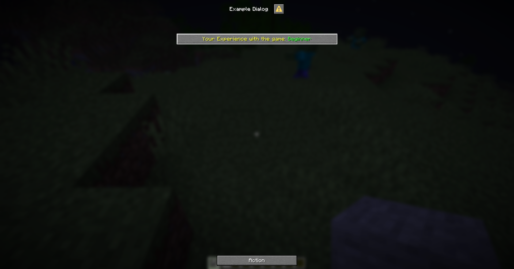

+++
title = "Select"
weight = 4
+++

This is an input component that allows the player to select an option from a list.

## Format

```yaml
select-input-name:
  # The type of the input component.
  type: select

  # The label of the input component.
  # If not specified, the label will be hidden
  label: "Select an option"

  # The width of the input component.
  # If not specified, the width will be 200 pixels.
  width: 200

  # The available options for the input component.
  # Each option is a key-value pair, where the key is the option's value and the value is the option's label.
  options:
    option1: "Option 1"
    option2: "Option 2"
    option3: "Option 3"

  # The key of the initial option for the input component.
  # If not specified, the first option will be selected by default.
  initial: option1
```

## Variable

When you use the `{dialog_<name>}` variable, it will return the key of the selected option.

If you want to get the label of the selected option, you can use the `{dialog_<name>:display}` variable.

## Example

```yaml
menu-settings:
  menu-type: notice-dialog
  title: "Example Dialog"
  command: exampledialog

experience:
  type: select
  label: "&eYour Experience with the game"
  width: 300
  options:
    beginner: "&aBeginner"
    intermediate: "&eIntermediate"
    advanced: "&6Advanced"
    expert: "&cExpert"
  initial: beginner

hello:
  type: action
  command:
    - "tell: &bYour selected experience is &f{dialog_experience}"
    - "tell: &bYour selected experience is &f{dialog_experience:display}"
```


