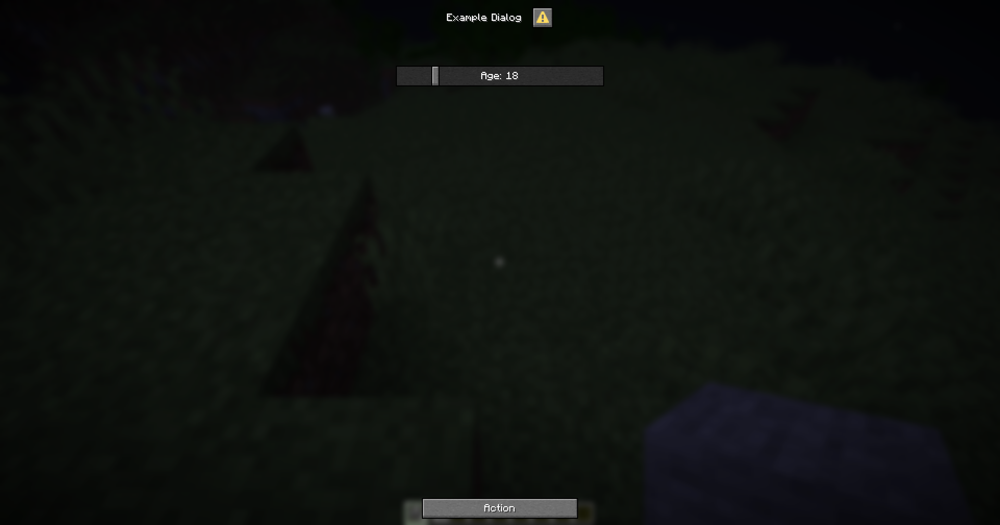

+++
title = "Slider"
weight = 3
+++

This is an input component that allows players to select a value within a specified range using a slider.

## Format

```yaml
slider-input-component:
  # The type of the input component.
  type: slider

  # The label for the input component.
  label: "Slider Label"

  # The format for the label.
  # If not specified, the label will be displayed as is.
  label-format: "options.generic_value"

  # The start value of the slider.
  start: 0

  # The end value of the slider.
  end: 100

  # The step value of the slider.
  # If not specified, the step will be calculated automatically based on the range.
  step: 1

  # The initial value of the slider.
  # If not specified, the initial value will be at the start of the range.
  initial: 50
```

## Value Format

You can define the display format for the slider value when using the variable by following the variable format `{dialog_<variable_name>:<format>}`

## Example

```yaml
menu-settings:
  menu-type: notice-dialog
  title: "Example Dialog"
  command: exampledialog

age:
  type: slider
  label: "Age"
  start: 0
  end: 100
  step: 1
  initial: 18

hello:
  type: action
  command:
    - "tell: &b&lYour age is &f&l{dialog_age}"
    - "tell: &b&lYour age is &f&l{dialog_age:000}"
```


