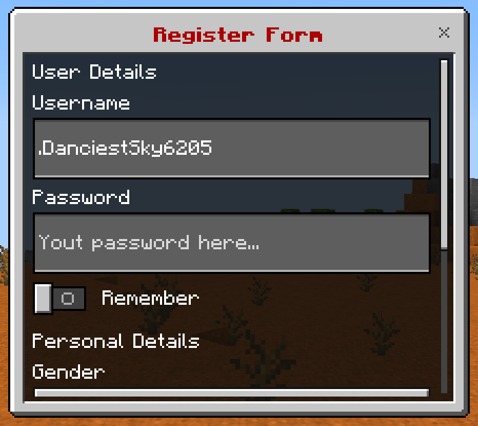

+++
title = "Custom Form"
weight = 3
+++

This is a complex form with a list of input components.

## Format

### Menu

```yaml
menu-settings:
  menu-type: custom-form

  # The title of the form
  title: <name>

  # The actions when the player opens the form
  open-action:
  - action
  - action
  - action
  ...

  # The actions when the player closes the form
  close-action:
  - action
  - action
  - action
  ...

  # The actions when the player does something invalid in the form
  invalid-action:
  - action
  - action
  - action
  ...

  # The actions when the player is not a Bedrock player
  java-action:
  - action
  - action
  - action
  ...

  # The requirement before the player can open the form
  view-requirement:
    <requirement-set>
    <requirement-set>
    <requirement-set>
    ...

  # The permission required to open the form
  permission: bettergui.test

  # The command to open the form
  command:
  - command1
  - command2
  ...

  # The list of argument processors to process the arguments of the command to open the form
  argument-processor:
    <argument-processor>
    <argument-processor>

# The components
component1:
  <setting>

component2:
  <setting>

component3:
  <setting>
```

### Component

#### Label

```yaml
component:
  type: label

  # The component text
  text: <text>
```

#### Input

```yaml
component:
  type: input

  # The component text
  text: <text>

  # The placeholder when there is no value in the input
  placeholder: <placeholder>

  # The default text
  default: <text>
```

#### Dropdown

```yaml
component:
  type: dropdown

  # The component text
  text: <text>

  # The options
  option: <placeholder>

  # The index of the option to choose as the default option
  default: <index>
```

#### Slider

```yaml
component:
  type: slider

  # The component text
  text: <text>

  # The minimum value
  min: <value>

  # The maximum value
  maximum: <value>

  # The step
  step: <value

  # The default value
  default: <value>
```

#### Step Slider

```yaml
component:
  type: step

  # The component text
  text: <text>

  # The options
  option: <placeholder>

  # The index of the option to choose as the default option
  default: <index>
```

#### Switch

```yaml
component:
  type: switch

  # The component text
  text: <text>

  # The default value
  default: <true/false>
```

#### Submit Button

```yaml
button1:
  type: submit

  # The component text
  text: <text>

  # The actions when clicking the button
  action:
  - action
  - action
  - action
  ...

  # The requirement to check when clicking the button
  click-requirement:
    <requirement-set>
    <requirement-set>
    <requirement-set>
    ...
```

## Note

### Menu Settings

* `open-action`: the [Action]({}) when the menu is opened.
* `close-action`: the [Action]({}) when the menu is closed.
* `invalid-action`: the [Action]({}) when the player does something invalid.
* `java-action`: the [Action]({}) when the player is not a Bedrock player.
* `view-requirement`: the [Requirement]({}) to check before opening the menu. If it is not met, the menu will not be opened.
* `argument-processor`: the [Argument Processor]({}) to handle the arguments of the command to open the menu.

### Component

* `action`: the [Action]({}) when the button is clicked.
* `click-requirement`: the [Requirement]({}) to check when the button is clicked. If it is not met, the `action` will not be executed.

### Variable

You can get the value of the component by using the format `{form_<component>}`, where `<component>` is the name of the component in the config. For example, use `{form_username}` to get the value of the component named `username`.

## Example

```yaml
menu-settings:
  menu-type: custom-form
  command: customform
  title: "&4&lRegister Form"

username:
  type: input
  text: "Username"
  placeholder: "Your username here..."
  default: "{player}"

password:
  type: input
  text: "Password"
  placeholder: "Yout password here..."

remember:
  type: toggle
  text: "Remember"

submit:
  type: submit
  action:
  - "tell: &eYour username is &f{form_username}"
  - "tell: &eYour password is &f{form_password}"
  click-requirement:
    remember-check:
      condition: "{form_remember}"
      fail-action: "tell: &cYour form is lost..."
```


