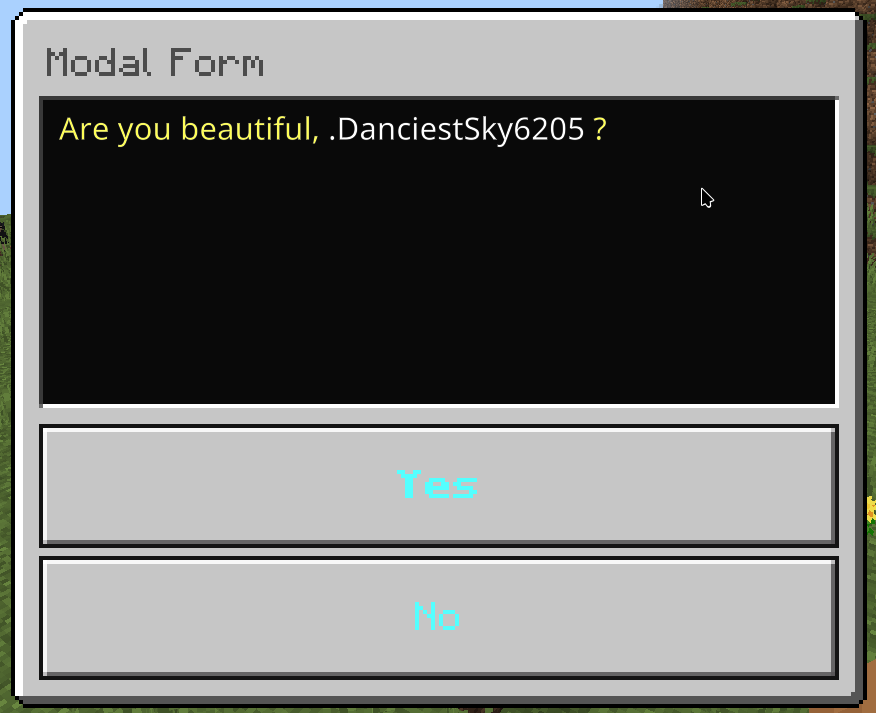

+++
title = "Modal Form"
weight = 1
+++

This is a simple form with 2 buttons.

## Format

```yaml
menu-settings:
  menu-type: modal-form

  # The title of the form
  title: <name>

  # The content of the form
  content: <content>

  # The actions when the player opens the form
  open-action:
  - action
  - action
  - action
  ...

  # The actions when the player closes the form
  close-action:
  - action
  - action
  - action
  ...

  # The actions when the player does something invalid in the form
  invalid-action:
  - action
  - action
  - action
  ...

  # The actions when the player is not a Bedrock player
  java-action:
  - action
  - action
  - action
  ...

  # The requirement before the player can open the form
  view-requirement:
    <requirement-set>
    <requirement-set>
    <requirement-set>
    ...

  # The permission required to open the form
  permission: bettergui.test

  # The command to open the form
  command:
  - command1
  - command2
  ...

  # The list of argument processors to process the arguments of the command to open the form
  argument-processor:
    <argument-processor>
    <argument-processor>

# The first button
button1:
  # The text of the button
  text: <text>

  # The actions when clicking the button
  action:
  - action
  - action
  - action
  ...

  # The requirement to check when clicking the button
  click-requirement:
    <requirement-set>
    <requirement-set>
    <requirement-set>
    ...

# The second button
button2:
  # The text of the button
  text: <text>

  # The actions when clicking the button
  action:
  - action
  - action
  - action
  ...

  # The requirement to check when clicking the button
  click-requirement:
    <requirement-set>
    <requirement-set>
    <requirement-set>
    ...
```

## Note

### Menu Settings

* `open-action`: the [Action]({}) when the menu is opened.
* `close-action`: the [Action]({}) when the menu is closed.
* `invalid-action`: the [Action]({}) when the player does something invalid.
* `java-action`: the [Action]({}) when the player is not a Bedrock player.
* `view-requirement`: the [Requirement]({}) to check before opening the menu. If it is not met, the menu will not be opened.
* `argument-processor`: the [Argument Processor]({}) to handle the arguments of the command to open the menu.

### Button

* `action`: the [Action]({}) when the button is clicked.
* `click-requirement`: the [Requirement]({}) to check when the button is clicked. If it is not met, the `action` will not be executed.

## Example

```yaml
menu-settings:
  menu-type: modal-form
  command: modalform
  title: "Modal Form"
  content: "&eAre you beautiful, &f{player} &e?"

  open-action: "tell: &eYou opened the form"
  close-action: "tell: &cYou closed the form"
  java-action: "tell: &cYou can't open this form because you're not a Bedrock player"

yes:
  text: "&b&lYes"
  click-requirement:
    check-level:
      level:
        value: 10
        take: false
      success-action: "tell: &eThanks for paticipating the form"
      fail-action: "tell: &eImprove yourself..."

no:
  text: "&bNo"
  action: "tell: &aIt's fine, you're beautiful as always"
```


