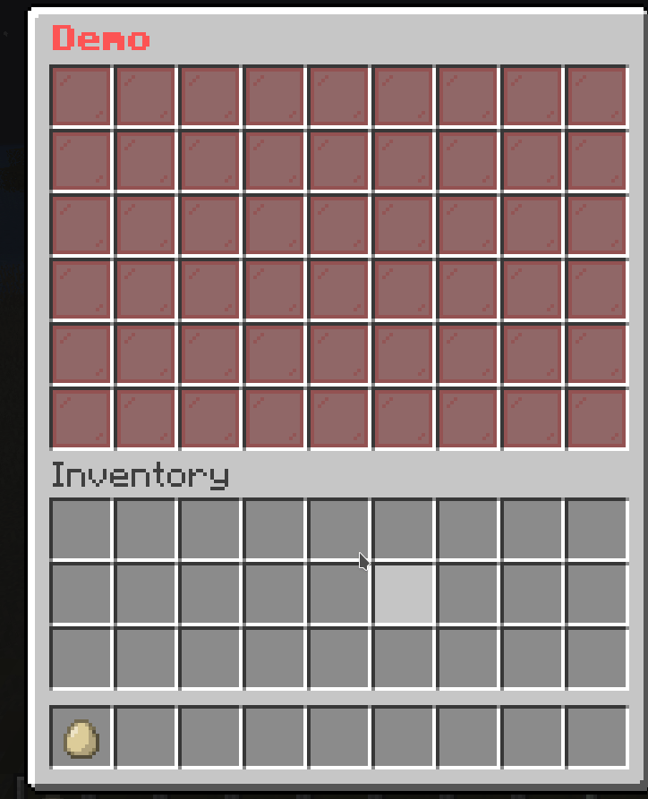
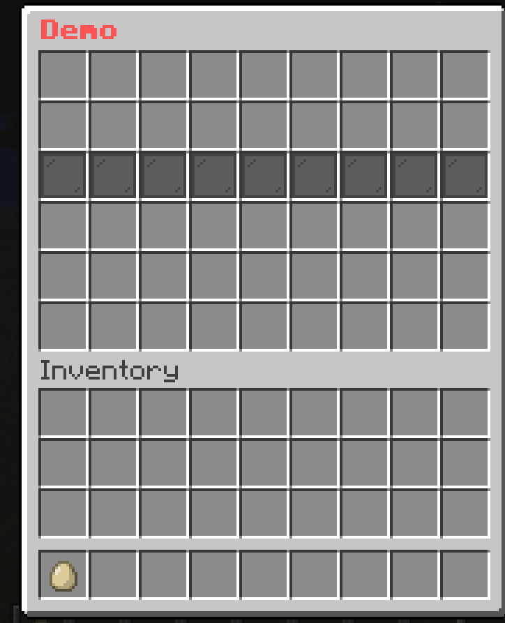
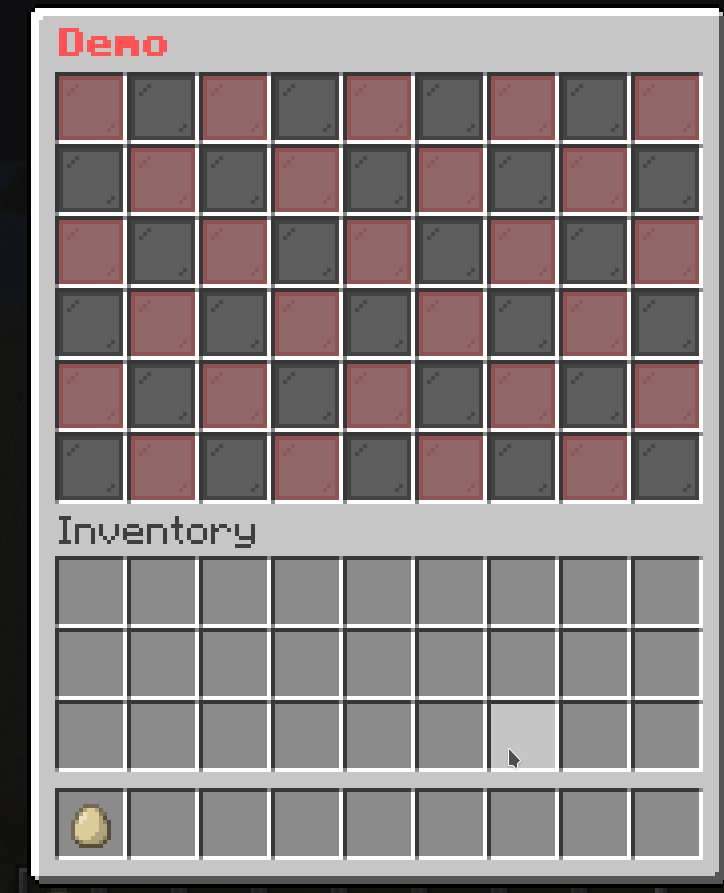

+++
title = "Animated Mask"
weight = 6
+++

Similar to [Animated Button]({}), this mask iterates through a list of masks and displays them in a sequence to create an animation.

## Format

```yaml
mask-name:
  mask: animated
  update: <ticks>
  child:
    mask-1:
      <mask-settings>
    mask-2:
      <mask-settings>
    ...
```

## Note

* `update`: The number of ticks between each frame.

## Example

```yaml
demo-slot:
  mask: animated
  update: 5
  child:
    frame1:
      slot: 0-53
      id: red_stained_glass_pane
      name: "&c&lFrame 1"
    frame2:
      slot: 0-53
      id: green_stained_glass_pane
      name: "&a&lFrame 2"
    frame3:
      slot: 0-53
      id: blue_stained_glass_pane
      name: "&9&lFrame 3"
```



```yaml
demo-slot:
  mask: animated
  update: 5
  child:
    frame1:
      slot: 0-8
      id: black_stained_glass_pane
      name: "&c&lFrame 1"
    frame2:
      slot: 9-17
      id: black_stained_glass_pane
      name: "&c&lFrame 2"
    frame3:
      slot: 18-26
      id: black_stained_glass_pane
      name: "&c&lFrame 3"
    frame4:
      slot: 27-35
      id: black_stained_glass_pane
      name: "&c&lFrame 4"
    frame5:
      slot: 36-44
      id: black_stained_glass_pane
      name: "&c&lFrame 5"
    frame6:
      slot: 45-53
      id: black_stained_glass_pane
      name: "&c&lFrame 6"
```



```yaml
demo-slot:
  mask: animated
  update: 5
  child:
    frame1:
      slot: 1-1-9-6
      mask: multislot
      child:
        button1:
          id: red_stained_glass_pane
          name: "&r"
        button2:
          id: black_stained_glass_pane
          name: "&r"
    frame2:
      slot: 1-1-9-6
      mask: multislot
      child:
        button1:
          id: black_stained_glass_pane
          name: "&r"
        button2:
          id: red_stained_glass_pane
          name: "&r"
```


