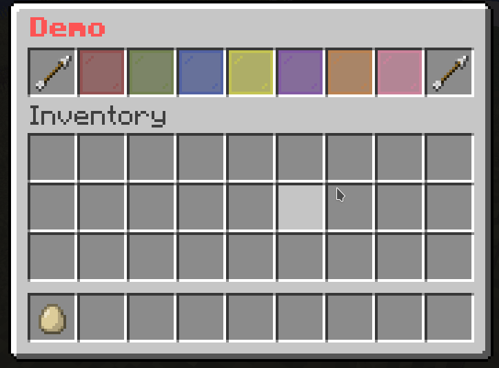

+++
title = "Button Paginated Mask"
weight = 10
+++

This is a mask that allows you to paginate [Buttons]({}). This is useful when you have a lot of buttons and you want to split them into multiple pages.

## Format

```yaml
mask-name:
  mask: button-paginated
  slot: <slot>
  cycle: <true/false>
  signal: <signal>
  child:
    button-1:
      <button-settings>
    button-2:
      <button-settings>
    ...
```

## Note

* `cycle`: Whether the buttons should cycle when you reach the end of the page. If this is set to `true`, then when you reach the end of the page, it will go back to the first page. If this is set to `false`, then when you reach the end of the page, it will stop at the last page.
* `signal`: The signal name used by actions to change the page.

## Action

* `next-page: <signal>`: Changes the page to the next page.
* `previous-page: <signal>`: Changes the page to the previous page.
* `set-page(<signal>): <page>`: Changes the page to `<page>`.

## Example

```yaml
# The paginated mask
demo-slot:
  mask: button-paginated
  slot: 1-7
  cycle: false
  signal: demo-page-signal # This is the signal name used by actions to change the page.
  child:
    button1:
      id: red_stained_glass_pane
      name: "&c&lButton 1"
    button2:
      id: green_stained_glass_pane
      name: "&a&lButton 2"
    button3:
      id: blue_stained_glass_pane
      name: "&9&lButton 3"
    button4:
      id: yellow_stained_glass_pane
      name: "&e&lButton 4"
    button5:
      id: purple_stained_glass_pane
      name: "&5&lButton 5"
    button6:
      id: orange_stained_glass_pane
      name: "&6&lButton 6"
    button7:
      id: pink_stained_glass_pane
      name: "&d&lButton 7"
    button8:
      id: black_stained_glass_pane
      name: "&0&lButton 8"
    button9:
      id: white_stained_glass_pane
      name: "&f&lButton 9"
    button10:
      id: gray_stained_glass_pane
      name: "&7&lButton 10"
    button11:
      id: light_gray_stained_glass_pane
      name: "&8&lButton 11"

# The button to go to the previous page
previous-button:
  slot: 0
  id: arrow
  name: "&c&lPrevious"
  command: "previous-page: demo-page-signal" # The action to change the page

# The button to go to the next page
next-button:
  slot: 8
  id: arrow
  name: "&a&lNext"
  command: "next-page: demo-page-signal" # The action to change the page
```


