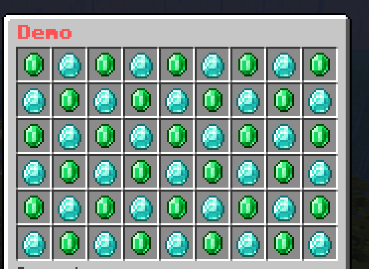
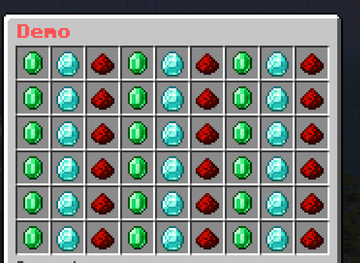

+++
title = "Multi-Slot Mask"
weight = 2
+++

It's the same as the [Simple Mask]({}) but there is a special feature when you add multiple [Buttons]({}).

## Format

```yaml
mask-name:
  mask: multislot
  slot: <slot>
  child:
    button-name-1:
      <button-settings>
    button-name-2:
      <button-settings>
    ...
```

## Example

```yaml
demo-slot:
  mask: multislot
  slot: 1-1-9-6
  child:
    emerald-button:
      id: emerald
      name: "&a&lEmerald"
```


```yaml
demo-slot:
  mask: multislot
  slot: 1-1-9-6
  child:
    emerald-button:
      id: emerald
      name: "&a&lEmerald"
    diamond-button:
      id: diamond
      name: "&b&lDiamond"
```



```yaml
demo-slot:
  mask: multislot
  slot: 1-1-9-6
  child:
    emerald-button:
      id: emerald
      name: "&a&lEmerald"
    diamond-button:
      id: diamond
      name: "&b&lDiamond"
    redstone-button:
      id: redstone
      name: "&c&lRedstone"
```



You may now understand what is the special feature of this mask. This mask will loop through the [`child` buttons]({}) and display them for each slot in the `slot` section.
