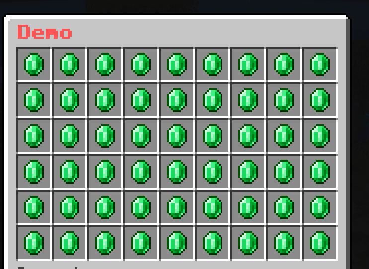
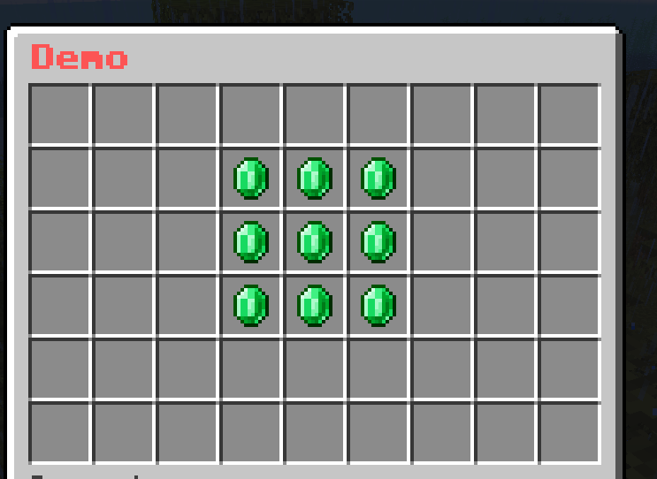
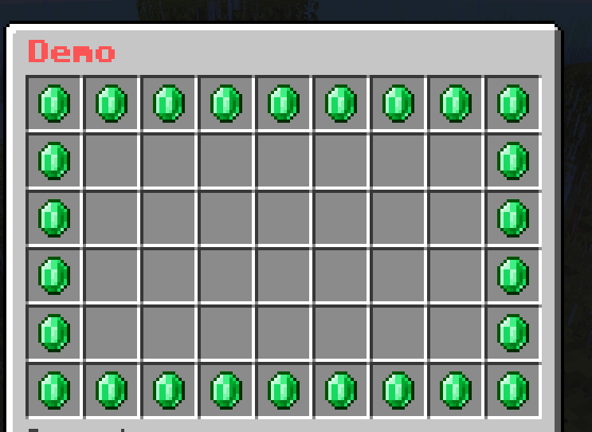

+++
title = "Slot Grid"
weight = 1
+++

Let's extend the concept of [Slot]({}) to add more features to it.

Start with this simple menu

```yaml
menu-settings:
  menu-type: masked
  command: demo
  title: "&c&lDemo"
  rows: 6

demo-slot:
  slot: 0-53
  id: emerald
```



You can see that I have set the `slot` to `0-53` which means that the `demo-slot` will be applied to all slots in the menu.

What if I want to use `slot` to specify a grid of slots, like a 3x3 grid in the middle of the menu?

Here is where I'll introduce a new format for `slot` called **Slot Grid**.

```yaml
slot: <x1>-<y1>-<x2>-<y2>
```

`<x1>` and `<y1>` are the coordinates of the top-left corner of the grid.

`<x2>` and `<y2>` are the coordinates of the bottom-right corner of the grid.

For example, I can replicate the previous menu by using `slot: 1-1-9-6`.

```yaml
demo-slot:
  slot: 1-1-9-6
  id: emerald
```

Or I can make a 3x3 grid in the middle of the menu by using `slot: 4-2-6-4`.

```yaml
demo-slot:
  slot: 4-2-6-4
  id: emerald
```



Cool, right? But what if I want only the outer border of the grid?

You can put `-o` at the end of the `slot` to specify that you want the outer border of the grid.

```yaml
demo-slot:
  slot: 1-1-9-6-o
  id: emerald
```


