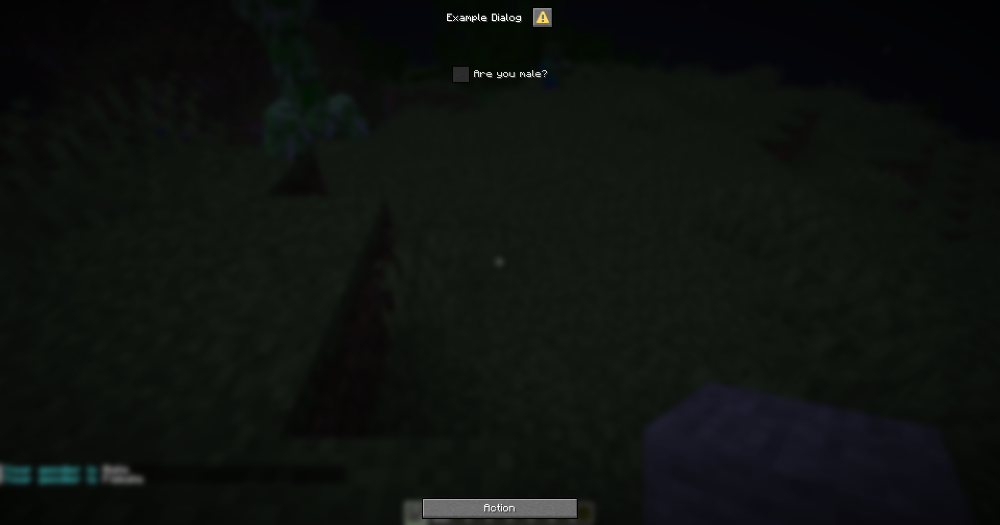

# {{ $frontmatter.title }}

This is an input component that allows players to check a box.

## Format

```yaml
checkbox-input-name:
  # The type of the input component
  type: checkbox

  # The label of the input component
  label: Checkbox Label

  # The initial state of the checkbox
  # If not specified, the checkbox will be unchecked by default
  initial: false

  # The value of the checkbox when checked
  # If not specified, the value will be "true"
  on-true: "Checked"

  # The value of the checkbox when unchecked
  # If not specified, the value will be "false"
  on-false: "Unchecked"
```

## Example

```yaml
menu-settings:
  menu-type: notice-dialog
  title: "Example Dialog"
  command: exampledialog

gender:
  type: checkbox
  label: "Are you male?"
  on-true: "Male"
  on-false: "Female"

hello:
  type: action
  command: "tell: &b&lYour gender is &f&l{dialog_gender}"
```

None