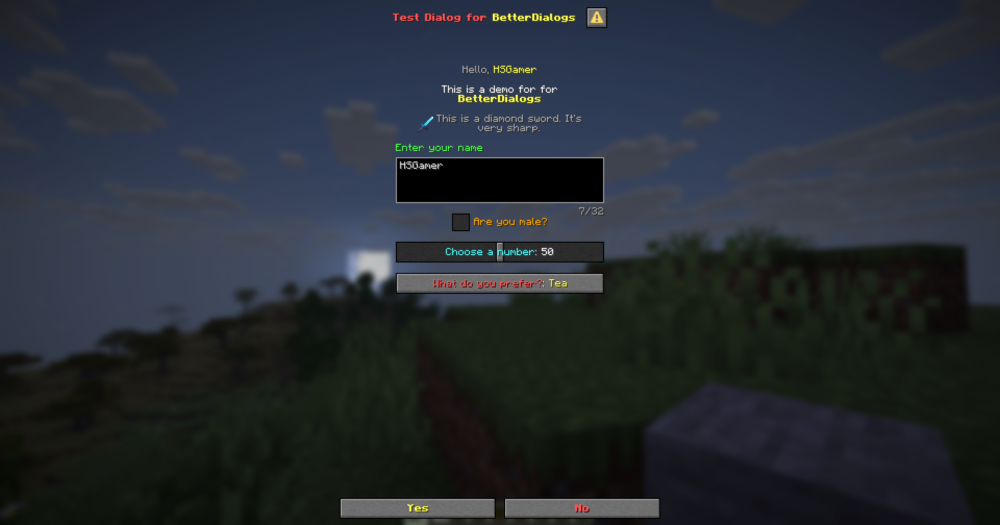

# {{ $frontmatter.title }}

## Format

```yaml
menu-settings:
  # The menu type of the dialog
  menu-type: action-dialog

  # The title of the dialog
  title: "Dialog Title"

  # Whether the menu will be closed when the player clicks a button
  can-close-with-action: true

  # The action to perform after the player clicks a button
  after-action: CLOSE

  # The actions when the player opens the dialog
  open-action:
  - action
  - action
  - action

  # The requirement before the player can open the dialog
  view-requirement:
    <requirement-set>
    <requirement-set>
    <requirement-set>
    ...

  # The permission required to open the dialog
  permission: bettergui.test

  # The command to open the dialog
  command:
  - command1
  - command2
  ...

  # The list of argument processors to process the arguments of the command to open the dialog
  argument-processor:
    <argument-processor>
    <argument-processor>
```

## Menu Settings

### `menu-type`

The type of the dialog

Available values:
- `confirmation-dialog`: A confirmation dialog with 2 buttons
- `action-dialog`: A dialog with multiple buttons
- `notice-dialog`: A notice dialog with a single button
- `server-links-dialog`: A dialog used to display server link

```yaml
menu-settings:
  menu-type: server-links-dialog
```

```yaml
menu-settings:
  menu-type: confirmation-dialog
```

### `can-close-with-action`

Whether the menu will be closed when the player clicks a button

Available values:
- `true`: The menu will be closed when the player clicks a button
- `false`: The menu will not be closed when the player clicks a button

```yaml
menu-settings:
  menu-type: confirmation-dialog
  can-close-with-action: true
```

### `after-action`

The action to perform after the player clicks a button

Available values:
- `CLOSE`: Close the menu
- `NONE`: Do nothing
- `WAIT_FOR_RESPONSE`: Wait for the server's response

```yaml
menu-settings:
  menu-type: confirmation-dialog
  after-action: CLOSE
```

```yaml
menu-settings:
  menu-type: confirmation-dialog
  after-action: NONE
```

### `columns`

The number of columns in the dialog

Only works when the `menu-type` is `action-dialog` or `server-links-dialog`

```yaml
menu-settings:
  menu-type: action-dialog
  columns: 3
```

### `button-width`

The width of the buttons in the dialog

Only works when the `menu-type` is `server-links-dialog`

```yaml
menu-settings:
  menu-type: server-links-dialog
  button-width: 10
```

## Example

```yaml
menu-settings:
  menu-type: confirmation-dialog
  title: "&c&lTest Dialog for &e&lBetterDialogs"
  command: testconfirmdialog

welcome:
  text: "&7Hello, &e{player}"
  width: 100

text-body:
  text: "&fThis is a demo for for &e&lBetterDialogs"

item:
  type: item
  material: DIAMOND_SWORD
  name: "&e&lDiamond Sword"
  lore:
    - "&7This is a diamond sword."
    - "&7It's very sharp."
    - "&b&lClick to open the dialog."
  enchant:
    - "durability, 1"
  description:
    text: "&7This is a diamond sword. It's very sharp."

name:
  type: input
  label: "&aEnter your name"
  initial: "{player}"

male:
  type: "boolean"
  label: "&6Are you male?"
  on-true: "Male"
  on-false: "Female"

number:
  type: number
  label: "&bChoose a number"
  start: 0
  end: 100
  step: 1
  initial: 50

select:
  type: select
  label: "&cWhat do you prefer?"
  options:
    tea: "&eTea"
    coffee: "&eCoffee"
    water: "&eWater"
  initial: "tea"

yes:
  type: action
  label: "&e&lYes"
  command:
    - "tell: &eName: &f{dialog_name}"
    - "tell: &eGender: &f{dialog_male}"
    - "tell: &eNumber: &f{dialog_number}"
    - "tell: &eSelection: &f{dialog_select:display} &7({dialog_select})"

no:
  type: action
  label: "&c&lNo"
  command: "tell: &cNevermind"
```



> [!NOTE]
> The lines below `menu-settings` are called `Component`. Those are the pieces of the body of the dialog.
> Continue to the next section for more information about the dialog components.