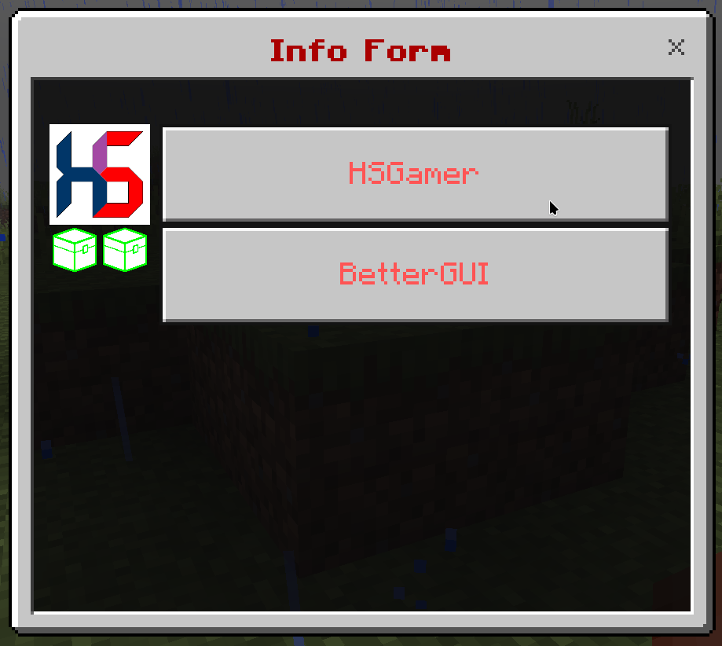

# Simple Form

This is a form with a list of buttons.

## Format

```yaml
menu-settings:
  menu-type: simple-form

  # The title of the form
  title: <name>

  # The actions when the player opens the form
  open-action:
  - action
  - action
  - action
  ...

  # The actions when the player closes the form
  close-action:
  - action
  - action
  - action
  ...

  # The actions when the player does something invalid in the form
  invalid-action:
  - action
  - action
  - action
  ...

  # The actions when the player is not a Bedrock player
  java-action:
  - action
  - action
  - action
  ...

  # The requirement before the player can open the form
  view-requirement:
    <requirement-set>
    <requirement-set>
    <requirement-set>
    ...

  # The permission required to open the form
  permission: bettergui.test

  # The command to open the form
  command:
  - command1
  - command2
  ...

  # The list of argument processors to process the arguments of the command to open the form
  argument-processor:
    <argument-processor>
    <argument-processor>

# The button
button1:
  # The text of the button
  text: <text>

  # The actions when clicking the button
  action:
  - action
  - action
  - action
  ...

  # The requirement to check when clicking the button
  click-requirement:
    <requirement-set>
    <requirement-set>
    <requirement-set>
    ...

  # The path to the image
  path: <path>

  # The URL to the image
  url: <url>

button2:
  ...

button3:
  ...
```

## Note

### Menu Settings

* `open-action`: the [Action](/action) when the menu is opened.
* `close-action`: the [Action](/action) when the menu is closed.
* `invalid-action`: the [Action](/action) when the player does something invalid.
* `java-action`: the [Action](/action) when the player is not a Bedrock player.
* `view-requirement`: the [Requirement](/requirement) to check before opening the menu. If it is not met, the menu will not be opened.
* `argument-processor`: the [Argument Processor](/argument) to handle the arguments of the command to open the menu.

### Button

* `action`: the [Action](/action) when the button is clicked.
* `click-requirement`: the [Requirement](/requirement) to check when the button is clicked. If it is not met, the `action` will not be executed.
* `path`: the path to the image displayed in the button. The `path` is mostly for texture packs
* `url`: the URL to the image displayed in the button.

## Example

```yaml
menu-settings:
  menu-type: simple-form
  command: simpleform
  title: "&4&lInfo Form"

profile:
  text: "&cHSGamer"
  url: "https://raw.githubusercontent.com/HSGamer/hsgamer.github.io/main/static/android-chrome-256x256.png"
  command: "tell: &eLink: &fhttps://hsgamer.me/"

bettergui:
  text: "&cBetterGUI"
  url: "https://raw.githubusercontent.com/BetterGUI-MC/.github/main/images/logo.png"
  command: "tell: &eLink: &fhttps://bettergui-mc.github.io/Docs/"
```

